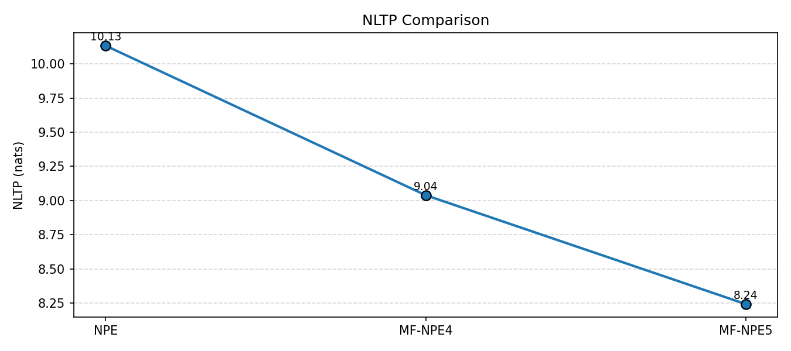
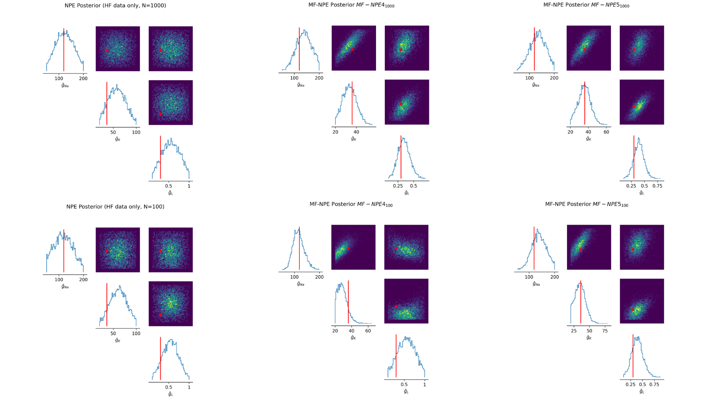

# Efficient Inference of Stochastic Models of Single Neurons with Multifidelity Simulation-Based Inference

[](https://www.python.org/downloads/)
[](https://pytorch.org/)
[](https://github.com/google/jax)

This repository contains the official source code and results for the Master's thesis titled "Efficient Inference of Stochastic Models of Single Neurons with Multifidelity Simulation-Based Inference" by Peter Oluwafemi Adepoju, submitted in partial fulfillment of a structured master's degree at the African Institute for Mathematical Sciences (AIMS), South Africa, a degree jointly awarded by the University of Cape Town.

This work implements and validates a Multifidelity Neural Posterior Estimation (MF-NPE) pipeline for efficiently inferring the biophysical parameters of stochastic Hodgkin-Huxley neuron models.

---

## Abstract

The voltage across the membranes of individual neurons is inherently stochastic, primarily due to the random transitions between conformational states of membrane ion channels. Accurately modelling these phenomena requires computationally intensive simulations, making parameter inference impractical for many neuroscience applications. This project addresses this challenge by developing a multifidelity simulation-based inference (SBI) approach. We combine inexpensive, low-fidelity simulations with a limited budget of costly, high-fidelity simulations to train a neural density estimator. Our results show that this approach significantly outperforms traditional methods, achieving higher accuracy while requiring orders of magnitude fewer high-fidelity simulations. The study presents a validated, open-source framework that enhances parameter inference in computational neuroscience.

---

## Key Results

Our primary finding is that the multifidelity approach (MF-NPE) can produce posterior distributions that are as accurate (or more accurate) than those from a standard Neural Posterior Estimator (NPE), while using significantly fewer computationally expensive, high-fidelity simulations.

|  |  |
|:---:|:---:|
| **Figure 1: NLTP Performance.** Negative Log-Probability of the True Parameters (NLTP, lower is better) vs. number of high-fidelity simulations. MF-NPE variants consistently outperform standard NPE. | **Figure 2: Posterior Accuracy.** Pairwise posteriors for MF-NPE (right) are sharper and more accurate than for standard NPE (left), despite using 10x fewer high-fidelity simulations. |

---

## Repository Structure

The project is organized into a core Python package (`mf_npe`), a vendored copy of the `sbi` library, and several top-level scripts for running experiments.

```
.
├── configs/                  # YAML configuration files for experiments. This is the "control panel".
│   └── hh_experiment.yml
├── mf_npe/                     # The core source code package for this project
│   ├── config/               # Task and plot configuration setup
│   ├── diagnostics/          # Diagnostic plots (PPC, SBC, etc.)
│   ├── flows/                # Building and training normalizing flows
│   ├── plot/                 # High-level plotting functions
│   ├── simulator/            # The LF (JAX) and HF (NumPy) simulators
│   ├── utils/                # Helper functions for stats, I/O, etc.
│   ├── evaluation.py         # The Evaluation class for computing metrics
│   ├── experiment.py         # Logic for a single experimental run
│   └── training.py           # Functions for training inference models
├── results/                  # Key figures and results from the thesis
├── sbi/                      # A local copy of the sbi (simulation-based inference) library
├── run_experiment.py         # TOP-LEVEL SCRIPT: Launch a new experiment from a config file.
├── run_evaluation.py         # TOP-LEVEL SCRIPT: Evaluate results and generate final plots.
└── requirements.txt          # A list of all project dependencies.
```

---

## Setup and Installation

### 1. Prerequisites
- Python 3.10 or higher
- Git

### 2. Clone the Repository
Clone this repository to your local machine:
```bash
git clone https://github.com/peter-adepoju/AIMS-Final-project.git
cd AIMS-Final-project
```

### 3. Install Dependencies
It is highly recommended to use a virtual environment to manage dependencies.

1.  **Create a Virtual Environment:**
    ```bash
    python -m venv venv
    ```

2.  **Activate the Environment:**
    *   On macOS/Linux:
        ```bash
        source venv/bin/activate
        ```
    *   On Windows:
        ```bash
        venv\Scripts\activate
        ```

3.  **Install the Required Packages:**
    With the virtual environment active, use `pip` to install all packages listed in the `requirements.txt` file.
    ```bash
    pip install -r requirements.txt
    ```

**Note:** This repository includes a local copy of the `sbi` library to ensure version consistency and reproducibility. The code imports directly from this local copy.

---

## How to Run the Experiments

This project is driven by a configuration file. The entire experimental workflow is controlled by editing `configs/hh_experiment.yml` and then running the top-level scripts.

### Step 1: Configure Your Experiment
Open `configs/hh_experiment.yml` and edit the parameters as needed. You can define:
- The output directory for all results (`output_dir`).
- The random seeds to run (`seeds`).
- The simulation budgets for the low- and high-fidelity models (`lf_sim_budgets`, `hf_sim_budgets`).
- The inference methods to run (`models_to_run`).
- All training and model hyperparameters.

### Step 2: Run the Training Pipeline
Execute the main experiment script from your terminal, pointing it to the configuration file. This will generate simulation data (or load it if it already exists), train all specified models for each random seed, and save the results.

```bash
python run_experiment.py configs/hh_experiment.yml
```
You can also override the seeds specified in the config file from the command line:
```bash
python run_experiment.py configs/hh_experiment.yml --seeds 42 100 2025
```
Outputs for each seed (data, plots, and trained models) will be saved in the directory specified by `output_dir` in the config file (e.g., `./outputs/hh_experiment_final/seed_42/`).

### Step 3: Run the Evaluation Pipeline
Once the training runs are complete, run the evaluation script. This script automatically finds all the per-seed results from the experiment, computes the final performance metrics, aggregates them across all seeds, and generates the final summary plots.

You must point it to the main experiment directory you defined in your config file.
```bash
python run_evaluation.py ./outputs/hh_experiment_final/
```
The final aggregated results (as `.csv` files) and summary plots (as `.svg` and `.html` files) will be saved in an `analysis/` sub-directory (e.g., `./outputs/hh_experiment_final/analysis/`).

---

## Citing this Work
If you use this code or the ideas presented in this project for your research, please cite the original thesis:

```bibtex
@mastersthesis{Adepoju2025,
  author       = {Adepoju, Peter Oluwafemi},
  title        = {Efficient Inference of Stochastic Models of Single Neurons with Multifidelity Simulation-Based Inference},
  school       = {African Institute for Mathematical Sciences (AIMS) South Africa},
  year         = {2025},
  month        = {July}
}
```

## Acknowledgements
This work was supervised by Prof. Pedro Gonçalves (VIB-Neuroelectronics Research Flanders, KU Leuven, Belgium).
```
